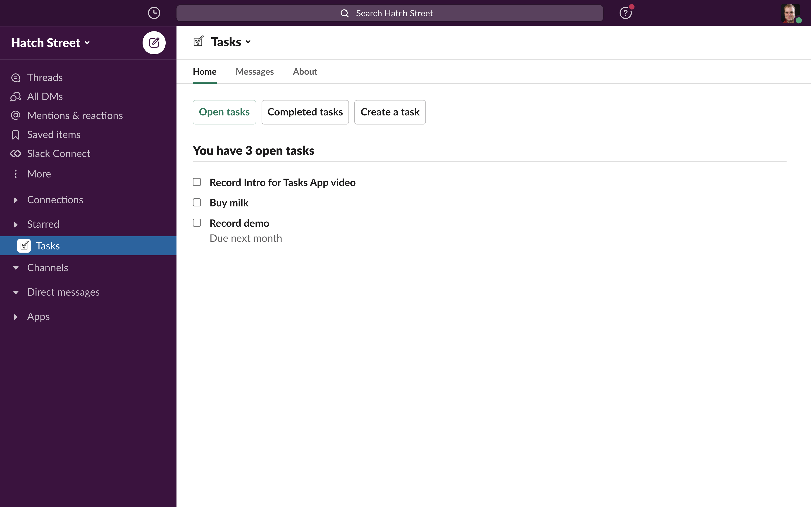
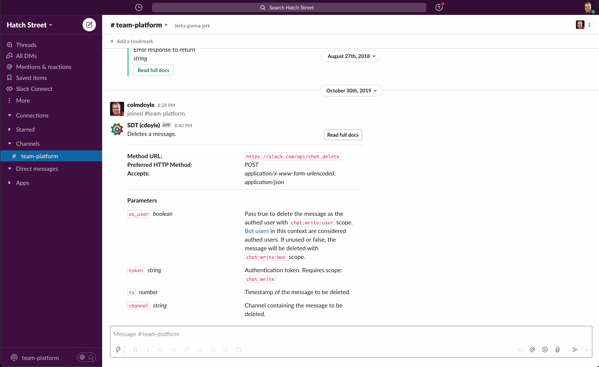

# Tasks App

As Tasks App is a tool designed to teach you about the Slack Platform, we don't currently offer a hosted version. If you're looking for a project management tool for your organisation, check out the many options available on our [App Directory](https://my.slack.com/apps/category/At0EFY3MJ4-project-management).

If you want to see the app in action, there's some screenshots below, or you can clone the repo and run it locally.

## App code

- [Setup](./docs/setup.md)
- [Project structure](./docs/structure.md)
## Screenshots

### Tasks list on App Home

### Creating tasks with a Global Shortcut

### Creating tasks from a message with a Message Shortcut

